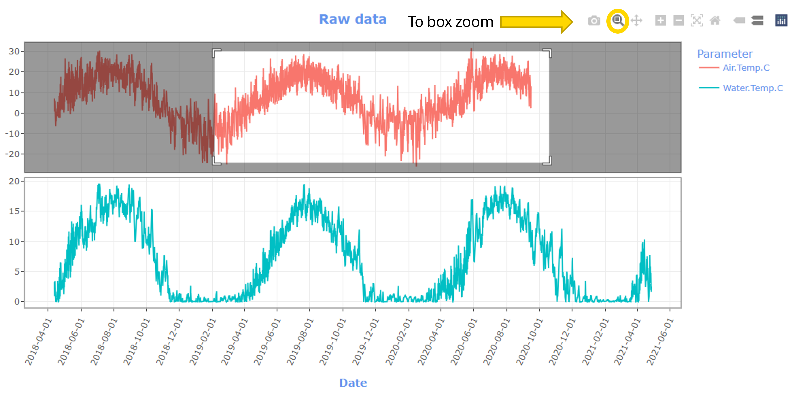

# Quick start
To begin, complete the steps under the **Upload Data** tab (consulting the **User Guide** tab as needed). As you complete a step in the **Upload Data** tab, the next step will appear. When you complete Step 3: Run meta summary, the **Discrete Data Exploration** tab will appear. The **USGS & Daymet Exploration** tab is available at all times to download and view USGS and Daymet data, but you can only visualize these downloaded data with your uploaded data after you complete Step 3. When you complete Step 4: Calculate daily statistics, the **Continuous Data Exploration** tab will appear. Use the three Exploration tabs to explore and visualize your data. To start over with a new dataset, refresh the page and upload a new dataset.

# Summary
This tool contains data summary and visualization modules for continuous monitoring data. Tool functionalities appear as the user provides required inputs. The landing tab walks the user through the process of uploading their data. Test data is available from the download button in the upper righthand corner of the application. Once the five steps of the upload data tab are successfully completed, additional tabs will display at the top of the page. The USGS & Daymet Exploration tab allows the user to download USGS gage data at their gage of choice and Daymet daily weather and climatology data at their coordinates of choice for the same time period as their uploaded data. The Discrete Data Exploration tab allows users to overlay discrete data points on a continuous time series of the same parameter. The Continuous Exploration tab provides daily summary statistics and visualizations for any uploaded parameters as well as specific statistics for temperature and hydrology parameters. 

# Guidance

## Start over with a new dataset
To analyze a new dataset, refresh the page to reset the inputs and upload the new input data file in step 1. 

## Time zone selection
For more information about the time zone options, including their deviation from UTC in standard time and daylight savings visit: <a href = "https://en.wikipedia.org/wiki/List_of_tz_database_time_zones" target = "_blank"> https://en.wikipedia.org/wiki/List_of_tz_database_time_zones</a> 


## Saving and interacting with plots
Most of the plots generated by the app are interactive. To save these plot as a static images, mouse over the plot to display the control panel in the upper right hand corner of the plot. Select the camera icon to open the file explorer window, then navigate to the location where you would like to save the plot and select save. To save the plots without interactive controls (e.g., air vs water temperature plot), mouse over the plot, right click, and select Save image as.

```{r, out.width = "50%", echo = FALSE}

```

Zooming is available on the interactive plots through the plus and minus buttons in the plot control panel, or by selecting the magnifying glass icon, which opens a box zoom that zooms to a user-drawn window. To reset the zoom, either double left click with the magnifying glass selected or select the home icon in the control panel. 

```{r, out.width = "50%", echo = FALSE}

```


## USGS gage data error messages
-  missing value where TRUE/FALSE needed: this error generally displays when an invalid gage id is provided. Check that the id you are inputting is an id in the National Water Information System (NWIS) database. 
-	arguments implying different number of rows: 1, 0: this error can be displayed when the input date range is entirely outside of the available range for the gage. Check the site page for your selected gage to confirm that the available date range does not overlap that of the uploaded data. Select a new gage that has an overlapping time period with the uploaded data. 
- 	Other errors: If the USGS web service times out, it is possible to see other errors. This may happen because too much data is being requested or the service itself is down. Try reducing the date range requested from the service. If that does not resolve the error, try downloading the data again in a few hours or days to rule out web service down time. See USGS documentation for more information on the USGS gage web service. If none of these solutions work, please submit an issue on the <a href = "https://github.com/USEPA/ContDataSumViz/issues" target = "_blank">ContDataSumViz repository</a> with details about how this module failed (gage id requested and date range of the uploaded data).


# Common issues
-  The date format displayed in the app may be different from your expectations. If you typically view your data in Excel, you might see a different date format because Excel often adds date formatting without alerting the user. If you open the file in a simple text editor like Notepad, the date format should match the application display. We recommend users view the head or tail of their uploaded files in the application before selecting the data format. 

# Performing quality control
Performing quality control checks on the continuous data prior to using ContDataSumViz is recommended, although some visualizations and summaries available in the application may be useful for quality control procedures. We recommend using  <a href = "https://shiny.epa.gov/ContDataQC/" target = "_blank">ContDataQC</a>, an U.S. EPA Shiny application designed to perform quality control checks on continuous water quality data, or another quality control tool prior to uploading data into ContDataSumViz. 

# Missing data
Single observation gaps (a missing value with non-missing values in the time point immediately preceding and following) are filled in for continuous data visualizations with the value preceding the missing one. This gap filling only occurs for the raw data time series, USGS gage/Daymet/base data time series, and discrete-continuous time series visualizations. Downloaded data will contain the same missing observations as the uploaded data. This feature is to account for minor differences in the frequency of parameter observations (e.g., one parameter has 15-minute observations, and another has 30-minute observations). Larger gaps (i.e., 2 or more consecutive NAs) are not filled. If parameter frequency differences result in larger gaps (e.g., one parameter has 15-minute observations and another has hourly observations), we recommend that users generate plots for these parameters separately or summarize the finer resolution parameter before uploading the data (e.g., for the 15-minute and hourly data, summarize the 15-minute data to 30-minute or hourly data).